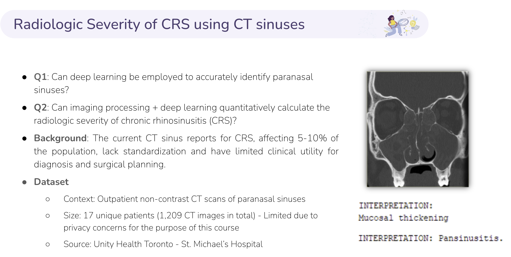

# The Use of Machine Learning to Identify Severity of Chronic Rhinosinusitis using Computed Tomography of Paranasal sinuses

Group 2: Nway Nway Aung, Daniel Lee, Amirhosein Rostami

  

 

### Research Question 

  

 

  

 

### Model

  

 

  

 

### Evaluation

  

 

#### Dice score for Sinus region

  

 

#### Prediction

  

 

  

 

  

 

  

 

### Report  
You can access the full report using the links below:  
- **[Google Doc Report](https://docs.google.com/document/d/1sHttOnVUQLHczV6QaMxFujFWgKn0Tjw05K5la5D2PrQ/edit?usp=sharing)**  
- **[Presentation](https://docs.google.com/presentation/d/1vgvnWRkAmeWUNUXBgqFN8wQwwZjU7mhv/edit?usp=sharing&ouid=112854345595891998973&rtpof=true&sd=true)**
