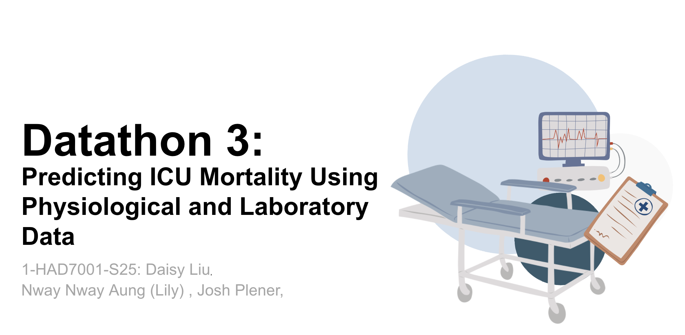
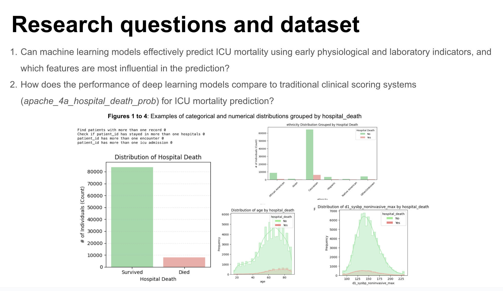
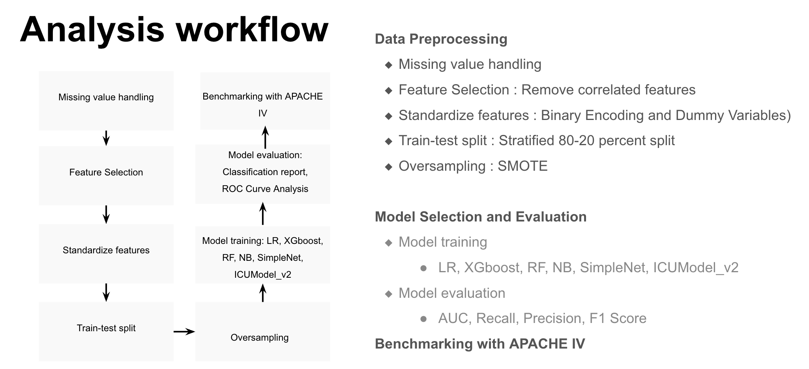
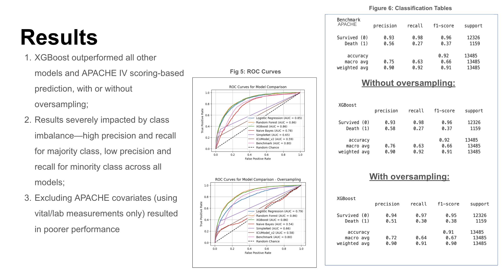

# Predicting ICU Mortality Using Physiological and Laboratory Data

Group 1: Nway Nway Aung (Lily), Josh Plener, Daisy Liu

### Background 

  

 

### RQs

  

 

### RQs

  

 

### Evaluation

  

 

  

 